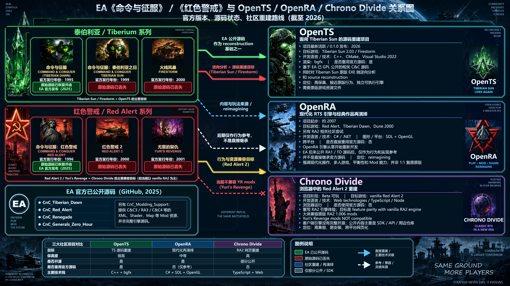

# cnc-ra-revive

[Live infographic](https://zjwww.github.io/cnc-ra-revive/) · [Changelog](CHANGELOG.md) · [Simplified Chinese](README.zh-CN.md)

A visual guide to the relationships between EA's **Command & Conquer / Red Alert** games and **OpenTS, OpenRA, and Chrono Divide**. The infographic combines the original game families, source-code status labels, community development approaches, and a project comparison in one sci-fi RTS layout.

**Current version: v1.1.** The infographic itself uses Simplified Chinese with English game and project names. This English README documents the same artifact; it is not an English translation of the graphic.

## View

- [Open the website](https://zjwww.github.io/cnc-ra-revive/).
- [Open the versioned v1.1 HTML](https://zjwww.github.io/cnc-ra-revive/v1.1/RA-4K.html).
- [Open the responsive v1.1 SVG](https://zjwww.github.io/cnc-ra-revive/v1.1/RA-4K.svg).
- [View the original 3840 × 2160 PNG](v1.0/RA-4K.png).

The HTML and standalone SVG scale to the browser's width while preserving the **16:9** canvas, artwork proportions, and internal layout. Short windows can scroll vertically. Narrow screens show the whole composition at a smaller size; use browser zoom for detailed reading.

Both v1.1 files are self-contained and can also be opened locally. No installation, build step, JavaScript framework, account, or external image download is required.

## Preview

The original PNG below previews the composition retained by v1.1. It is the archived v1.0 render, not a separately generated v1.1 PNG.

## What the diagram covers

- Tiberian Dawn, Tiberian Sun, and Firestorm.
- Red Alert, Red Alert 2, and Yuri's Revenge.
- EA's publicly released source repositories and the distinction between engine source and modding resources.
- OpenTS source reconstruction, OpenRA's modernized interpretation, and Chrono Divide's browser-based RA2 approach.
- Colored relationships, source-status labels, and a side-by-side comparison table.

This repository publishes an informational graphic. It does not contain a playable game, an engine implementation, or original game data.

## Files and version preservation

| Path | Purpose |
| --- | --- |
| `index.html` | Current website entry point; a byte-for-byte copy of `v1.1/RA-4K.html`. |
| `v1.0/RA-4K.html` | Original fixed-size HTML. |
| `v1.0/RA-4K.svg` | Original fixed-size, editable SVG. |
| `v1.0/RA-4K.png` | Original 3840 × 2160 raster export. |
| `v1.1/RA-4K.html` | Responsive HTML with inline SVG. |
| `v1.1/RA-4K.svg` | Responsive standalone SVG. |
| `README.md` / `README.zh-CN.md` | English and Simplified Chinese project documentation. |
| `CHANGELOG.md` / `CHANGELOG.zh-CN.md` | Matching version histories. |
| `.nojekyll` | Direct static-file publishing on GitHub Pages. |

Published version directories are preserved. Future functional or content changes go into **v1.2, v1.3, and subsequent directories**, without overwriting earlier versions. The root `index.html` may then be updated to match the newly selected current HTML. Both changelogs should be updated together.

Git commits and version directories provide the publication history. GitHub Releases are not needed for this static website and are not part of the v1.1 publication.

## Editing

Important text, table entries, borders, and arrows are editable SVG elements. Edit a copy of the SVG or the inline SVG inside the HTML with a UTF-8 text editor or an SVG-capable editor. The HTML is a static viewer; it does not offer click-to-edit controls or in-browser saving.

Keep the `0 0 3840 2160` viewBox and proportional scaling rules. When changing copy, check wrapping, text boundaries, and image separation. The HTML and SVG are separate files: update both copies deliberately for a new version. To export a PNG, render at **3840 × 2160** explicitly; a browser screenshot at another window size will have that window's dimensions.

## Scope and visual limitations

The content is an editorial snapshot prepared in September 2026, not a live status monitor or a complete technical audit. Strong labels such as “original source code lost” are inherited from the supplied infographic brief; this repository does not independently establish those historical claims. Lack of a public source release alone does not prove that all original source copies are lost. Fidelity ratings are qualitative, and compatibility can change.

Backgrounds, game-style illustrations, and emblems include AI-generated reconstructions and may differ from official artwork. Text and diagram geometry were rendered on a 3840 × 2160 canvas, but the decorative raster source was 1672 × 941; the artwork is **not entirely native 4K**. The complete infographic was rebuilt rather than simply enlarging the supplied reference. Typography uses system fonts, primarily Microsoft YaHei and Arial, so rendering can differ on systems without those fonts.

The self-contained HTML and SVG are each approximately 10 MB because images are embedded. A later version could share and optimize image assets to improve loading speed while retaining the archived files.

## Upstream references

Use upstream documentation for current project status and technical details:

- [EA: CnC_Tiberian_Dawn](https://github.com/electronicarts/CnC_Tiberian_Dawn) — official public source repository.
- [OpenTS](https://github.com/OpenTS-Developers/OpenTS) — Tiberian Sun reconstruction project and documentation.
- [About OpenRA](https://www.openra.net/about/) — project goals and modernized gameplay.
- [Chrono Divide](https://chronodivide.com/) — browser-based Red Alert 2 project.
- [Chrono Divide Mod SDK](https://github.com/chronodivide/mod-sdk) — modding compatibility and limitations.

## Hosting

GitHub Pages publishes the `main` branch from the repository root. `index.html` opens the infographic on the website; `README.md` remains the default project description on GitHub. The `.nojekyll` file disables Jekyll processing. See [GitHub's Pages setup documentation](https://docs.github.com/en/pages/getting-started-with-github-pages/creating-a-github-pages-site).

## Attribution and licensing

This is an independent community infographic and is not affiliated with or endorsed by Electronic Arts, OpenTS, OpenRA, or Chrono Divide. Game names, trademarks, project names, and third-party visual identities are acknowledged as belonging to their respective owners.

No project-wide redistribution license has been selected for this repository. Public availability should not be interpreted as a blanket license for third-party artwork or marks. The upstream projects have their own licenses; those licenses do not automatically apply to this infographic.
