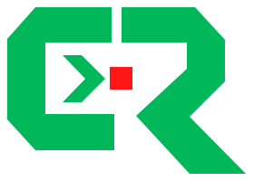
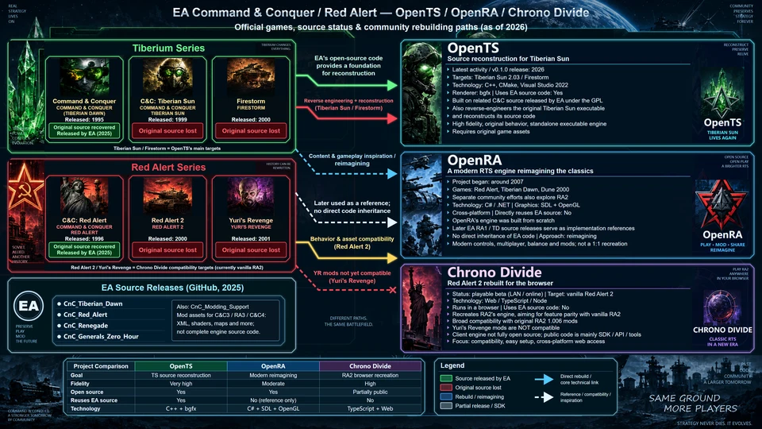

  <picture>
    <source media="(prefers-color-scheme: dark)" srcset="assets/logo-dark.svg">
    <source media="(prefers-color-scheme: light)" srcset="assets/logo-light.svg">
    
  </picture>
  <h1>CnC-RA-Revive</h1>
  
A visual guide to Command &amp; Conquer / Red Alert and OpenTS, OpenRA, and Chrono Divide.

  

    
    
    
    
    
  

  
<a href="README.md">English</a> | <a href="README.zh-CN.md">简体中文</a> | <a href="https://zjwww.github.io/cnc-ra-revive/CnC-RA-Revive-4k-Native-EN.html">Published site</a> | <a href="https://github.com/zjwww/cnc-ra-revive/issues">Issues</a>

The 960 × 540 WebP is for documentation preview only. [Changelog](CHANGELOG.md).

**Published editions: English v1.12-en · Simplified Chinese v1.11.** The website homepage remains the unchanged Chinese v1.11 native viewer. Each language offers two zoom mechanisms in four self-contained HTML/SVG files, preserving the 3840 × 2160 coordinate system, 16:9 proportions, 177 text positions and fixed layout. The English edition translates the text and adjusts selected font sizes; viewer scripts and artwork geometry are unchanged.

English v1.12-en validation covered 32 desktop checks at 150% display scaling, four consistent default document screenshots, 44 link checks / 48 new-tab activations and mobile emulation for all four English documents. These are recorded local tests; no new physical iPhone / Safari test was performed.

## Browser tab titles

Both formats use `CnC-RA-Revive · Native Scale` or `CnC-RA-Revive · Viewer Scale`. On desktop, the Viewer Scale pair appends its current in-page percentage, for example `CnC-RA-Revive · Viewer Scale 110%`. Native Scale does not duplicate the browser menu percentage. Mobile titles retain the mode name without a percentage. Infographic text is unchanged.

## Open a version

| Language / version | Mechanism | HTML | SVG |
| --- | --- | --- | --- |
| English v1.12-en | Browser-native zoom | [HTML](https://zjwww.github.io/cnc-ra-revive/CnC-RA-Revive-4k-Native-EN.html) | [SVG](https://zjwww.github.io/cnc-ra-revive/CnC-RA-Revive-4k-Native-EN.svg) |
| English v1.12-en | In-page code zoom | [HTML](https://zjwww.github.io/cnc-ra-revive/CnC-RA-Revive-4k-Viewer-EN.html) | [SVG](https://zjwww.github.io/cnc-ra-revive/CnC-RA-Revive-4k-Viewer-EN.svg) |
| Simplified Chinese v1.11 | Browser-native zoom | [HTML](https://zjwww.github.io/cnc-ra-revive/index.html) | [SVG](https://zjwww.github.io/cnc-ra-revive/CnC-RA-Revive-4k-Native.svg) |
| Simplified Chinese v1.11 | In-page code zoom | [HTML](https://zjwww.github.io/cnc-ra-revive/CnC-RA-Revive-4k-Viewer.html) | [SVG](https://zjwww.github.io/cnc-ra-revive/CnC-RA-Revive-4k-Viewer.svg) |

Open each SVG directly in a browser tab for its interactive behavior. Each HTML and SVG includes its own artwork and script, so none requires a neighboring file or network connection. The two formats in each pair use identical viewer code.

## Fractional display scaling

The desktop width fit uses fractional viewport measurements instead of rounded `clientWidth`, and rounds the artwork width down to a physical pixel. Height follows the same 16:9 scale. This fixes a subpixel overhang that could produce a horizontal scrollbar at the fitted size, including 4K windows with 150% display scaling. The fit may leave less than one physical pixel unused. Without the Visual Viewport API, a conservative one-CSS-pixel inset is used.

Horizontal overflow is not hidden: intentional native or in-page enlargement still allows scrolling to the right edge. Mobile stable-viewport measurement and browser-native gestures are unchanged. The eleven links and tooltip changes from v1.9 are retained.

## Project links

Eleven marked project names are clickable in every HTML/SVG file. Hovering adds an underline and displays the destination URL; keyboard focus also adds an underline. Links request a new tab (`target="_blank"`), leaving the infographic open. Browser preferences control whether the new browsing context is a tab or window.

The three right-hand headings link to OpenTS on GitHub, the OpenRA website and the Chrono Divide website. The bottom comparison headings link to OpenTS on GitHub, OpenRA on GitHub and the Chrono Divide GitHub organization. The four EA source names and `CnC_Modding_Support` link to their corresponding Electronic Arts GitHub repositories.

HTML uses a document title in its head, while standalone SVG uses its root document title. The inline SVG in HTML has no root title, avoiding an image-wide hover tooltip. Project links retain their own destination tooltips. Open SVG directly as a document to use its links and controls.

## iPhone / touch browsing

All eight files delegate pinch zoom and panning to the mobile browser. The in-page pair retains code-driven wheel/keyboard controls on desktop only. Mobile tab titles use the same English mode names without a percentage; touch gestures remain browser-native in both pairs.

The first fit uses stable small-viewport CSS width (`svw`) where supported; stable height (`svh`) also participates in rotation-settling checks. Pinch zoom, panning and toolbar-only height changes do not rewrite the artwork size. A rotation or genuine layout-width change is fitted after about 150 ms of stable measurements and two animation-frame checks. Differences within one CSS pixel are ignored. An 800 ms deadline abandons an unsettled attempt; it never forces a fit during an active touch gesture. Subsequent relevant events can start a new attempt.

No mobile touch/gesture default is cancelled, browser zoom is not reset, and the script never calls `scrollTo()` on mobile. Rotation does not promise to preserve an exact image coordinate: Safari controls its own zoom and scroll restoration. A stable new orientation may change the fitted size once. Without small-viewport unit support, fitting is conservatively limited to initial load and orientation changes.

The v1.7 mobile candidate was tested by the user on the reported iPhone 14 Pro / iOS 26.6.2 without further issues. The current version retains that gesture policy and width fitting. Automated desktop/mobile emulation checks do not replace real-device testing of this new fit. The graphic, arrow fixes and 16:9 coordinates are unchanged.

## Desktop zoom behavior

| Action | Native pair | In-page pair |
| --- | --- | --- |
| Ctrl + wheel, Ctrl + plus/minus | Browser handles zoom; its menu percentage changes. | Code zooms the artwork from 25% to 500%; browser percentage stays unchanged. |
| Ctrl + 0 | Browser returns to 100%. | Restore width-fitted artwork and scroll to the top-left. |
| Percentage display | Browser zoom menu. | HTML and SVG tab titles, for example “CnC-RA-Revive · Viewer Scale 150%”. |
| Resize window | Adapt the fitted reference while retaining relative native zoom. | Adapt the fit while retaining the selected in-page multiplier. |
| Reload | Keep the native fitted reference when session storage is available. | Reset in-page zoom to the fitted size. |

All eight files initially **fit the available viewport width**. Height follows at 9/16 of the artwork width; a shorter window uses vertical scrolling. The artwork is never stretched, cropped or rearranged. Desktop zoom enlarges or reduces this width-fit reference; after enlargement, use ordinary scrolling to reach the rest of the graphic. Mobile pinch zoom remains controlled by the browser.

### Native fit reference

The native pair leaves wheel and keyboard defaults intact. A small script calculates proportional dimensions; it does not set or simulate the browser's zoom percentage. The first visit in a tab establishes a fit reference at the browser's **current** zoom and display scaling. Session storage retains this reference through reloads, where supported.

For comparable baseline testing, set the browser to **100% before opening each file in a fresh tab**. Opening a fresh tab for the first time at 150% fits the image at that initial 150%; this is intentionally different from opening at 100% and then enlarging to 150%. Ctrl + 0 always resets browser zoom, but does not redefine the stored fit reference. If session storage is blocked, reloading establishes a new reference. Moving between monitors with different display scaling has not been verified; use a fresh tab to establish a new reference there.

### In-page controls and compatibility

Focus the document before using shortcuts. Ctrl + equals and numeric-keypad plus/minus are also supported. Wheel zoom retains the point under the pointer where scrolling bounds allow; keyboard zoom uses the viewport center. Both HTML and standalone SVG titles display the desktop in-page multiplier, not browser zoom. Changing zoom directly in the browser menu remains a separate browser operation.

JavaScript is required for the shared sizing behavior and in-page controls. SVG scripts run when opened as an interactive document; embedding an SVG using an HTML image element disables its scripts, so it becomes a static image. The graphic remains editable SVG text and imagery in every file.

## What the diagram covers

- Tiberian Dawn, Tiberian Sun, and Firestorm.
- Red Alert, Red Alert 2, and Yuri's Revenge.
- EA's publicly released source repositories and the distinction between engine source and modding resources.
- OpenTS source reconstruction, OpenRA's modernized interpretation, and Chrono Divide's browser-based RA2 approach.
- Colored relationships, source-status labels, and a side-by-side comparison table.

This repository publishes an informational graphic. It does not contain a playable game, an engine implementation, or original game data.

## Files and version preservation

The Chinese v1.11 edition contains `index.html`, `CnC-RA-Revive-4k-Native.svg`, `CnC-RA-Revive-4k-Viewer.html`, and `CnC-RA-Revive-4k-Viewer.svg`. English v1.12-en adds `CnC-RA-Revive-4k-Native-EN.html`, `CnC-RA-Revive-4k-Native-EN.svg`, `CnC-RA-Revive-4k-Viewer-EN.html`, and `CnC-RA-Revive-4k-Viewer-EN.svg`. Language-specific WebP previews, light/dark SVG logos and bilingual documentation are included. Full-size PNG exports, logo concept boards, working scripts and historical version directories remain local. Earlier published files remain available in Git history.

## Editing

Important text, table entries, borders, and arrows are editable SVG elements. Edit a copy of the SVG or the inline SVG inside the HTML with a UTF-8 text editor or an SVG-capable editor. The HTML is a static viewer; it does not offer click-to-edit controls or in-browser saving.

Keep the `0 0 3840 2160` viewBox, proportional scaling rules, and viewer controls. When changing copy, check wrapping, text boundaries, and image separation. The HTML and SVG are separate files: update both copies deliberately for a new version. To export a PNG, render at **3840 × 2160** explicitly; a browser screenshot at another window size will have that window's dimensions.

## Scope and visual limitations

The content is an editorial snapshot prepared in September 2026, not a live status monitor or a complete technical audit. Strong labels such as “original source code lost” are inherited from the supplied infographic brief; this repository does not independently establish those historical claims. Lack of a public source release alone does not prove that all original source copies are lost. Fidelity ratings are qualitative, and compatibility can change.

Backgrounds, game-style illustrations, and emblems include AI-generated reconstructions and may differ from official artwork. Text and diagram geometry were rendered on a 3840 × 2160 canvas, but the decorative raster source was 1672 × 941; the artwork is **not entirely native 4K**. The complete infographic was rebuilt rather than simply enlarging the supplied reference. Typography uses system fonts, primarily Microsoft YaHei and Arial, so rendering can differ on systems without those fonts.

The self-contained HTML and SVG are each approximately 10 MB because images are embedded.

## Upstream references

Use upstream documentation for current project status and technical details:

- [EA: CnC_Tiberian_Dawn](https://github.com/electronicarts/CnC_Tiberian_Dawn) — official public source repository.
- [OpenTS](https://github.com/OpenTS-Developers/OpenTS) — Tiberian Sun reconstruction project and documentation.
- [About OpenRA](https://www.openra.net/about/) — project goals and modernized gameplay.
- [Chrono Divide](https://chronodivide.com/) — browser-based Red Alert 2 project.
- [Chrono Divide Mod SDK](https://github.com/chronodivide/mod-sdk) — modding compatibility and limitations.

## Hosting

GitHub Pages serves the repository root on `main`. The default homepage remains Chinese v1.11 native HTML, unchanged by the English publication. Use the version table above to open English v1.12-en. There is no in-viewer language switch.

## Attribution and licensing

This is an independent community infographic and is not affiliated with or endorsed by Electronic Arts, OpenTS, OpenRA, or Chrono Divide. Game names, trademarks, project names, and third-party visual identities are acknowledged as belonging to their respective owners.

Project-owned viewer code, documentation, original diagram text/geometry and original logo contributions are available under the [MIT License](LICENSE), only to the extent the contributors hold the relevant rights. See [licensing scope](LICENSING.md) for exclusions. Third-party game artwork, names, trademarks, logos and upstream materials are not licensed by this project. AI-assisted images carry no promise of exclusive copyright or third-party clearance; inclusion does not grant rights the contributors do not hold. Upstream projects retain their own licenses.
