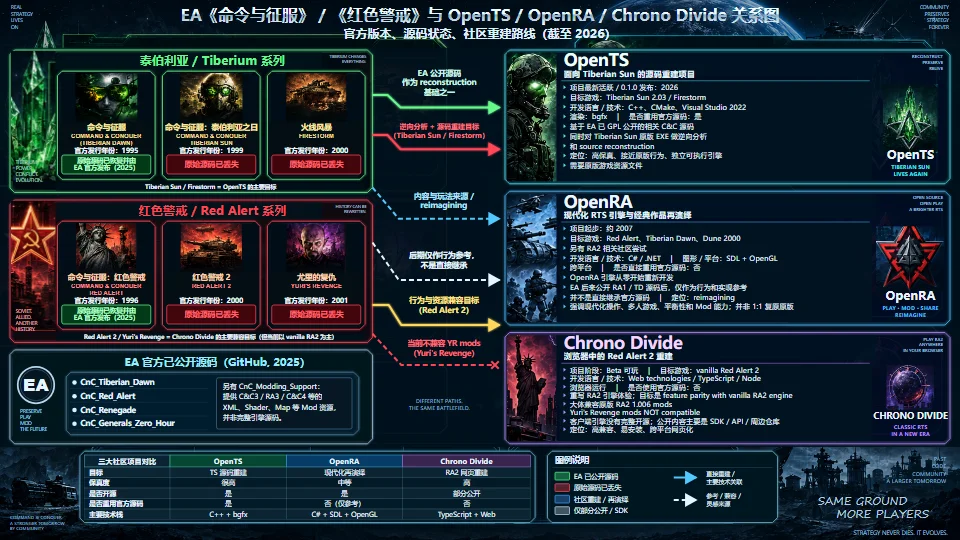

# cnc-ra-revive

[更新日志](CHANGELOG.zh-CN.md) · [English](README.md) · [已发布网站](https://zjwww.github.io/cnc-ra-revive/)

展示 EA **《命令与征服》／《红色警戒》**与 **OpenTS、OpenRA、Chrono Divide** 之间关系的信息图。

**当前版本：v1.6。** 网站首页默认使用浏览器原生缩放。 提供两套缩放机制、四个独立文件。每个文件均保留原来的 3840 × 2160 坐标系、16:9 图像比例、177 个文字元素和固定内部布局。

## 选择版本

| 缩放机制 | HTML 网页 | 独立 SVG |
| --- | --- | --- |
| 浏览器原生缩放 | [index.html](https://zjwww.github.io/cnc-ra-revive/index.html) | [RA-4K.svg](https://zjwww.github.io/cnc-ra-revive/RA-4K.svg) |
| 页面内代码缩放 | [RA-4K-viewer.html](https://zjwww.github.io/cnc-ra-revive/RA-4K-viewer.html) | [RA-4K-viewer.svg](https://zjwww.github.io/cnc-ra-revive/RA-4K-viewer.svg) |

SVG 请直接在浏览器标签页中打开，以使用交互功能。每个 HTML、SVG 均内嵌图片和脚本，可单独使用，不依赖相邻文件或网络连接。同一套中的两个格式使用完全相同的查看器代码。

## 缩放行为

| 操作 | 原生缩放组 | 页面内缩放组 |
| --- | --- | --- |
| Ctrl + 滚轮、Ctrl + 加减键 | 浏览器处理缩放，菜单百分比随之变化。 | 代码按 25%～500% 缩放图像，浏览器百分比保持原值。 |
| Ctrl + 0 | 浏览器恢复 100%。 | 图像恢复适配窗口，并滚动回左上角。 |
| 倍率显示 | 浏览器缩放菜单。 | 标签页标题，例如“页面内缩放 150%”。 |
| 调整窗口大小 | 适配基准随窗口调整，保留相对原生缩放。 | 重新计算适配尺寸，保留所选页面内倍率。 |
| 刷新 | 会话存储可用时，保留原生缩放的适配基准。 | 页面内倍率恢复为适配窗口的初始值。 |

两套初始均按**窗口宽、高容纳完整图像**，不会拉伸图像或重排模块。多余空间留在图像外部。放大后，可用普通滚动查看其余部分。

### 原生版适配基准

原生组不拦截滚轮与快捷键的默认行为。少量脚本只负责等比尺寸计算，不设置或模拟浏览器菜单百分比。标签页首次访问时，按浏览器**当前**缩放与显示缩放建立适配基准；支持会话存储时，刷新会保留该基准。

为便于四个文件对比，建议先将浏览器设为 **100%，再用新标签页打开文件**。首次在 150% 的新标签页打开，会以初始 150% 为适配基准；这与先在 100% 打开、再放大至 150% 的显示尺寸不同。Ctrl + 0 始终重置浏览器倍率，不重新定义已保存的适配基准。禁用会话存储时，刷新会重新建立基准。跨不同显示缩放的显示器移动窗口尚未验证，可在目标显示器使用新标签页重新建立基准。

### 页面内操作与兼容性

使用快捷键前先让文档获得焦点。支持 Ctrl + 等号和数字小键盘加减键。滚轮缩放尽量保持鼠标指向的图内位置，受滚动边界限制；键盘缩放以可视区域中心为锚点。标签页标题显示页面内倍率，不代表浏览器倍率。直接操作浏览器菜单仍属于另一套浏览器操作。

共同的尺寸适配及页面内交互需要 JavaScript。SVG 作为独立交互文档打开时可运行脚本；通过 HTML 图片元素嵌入时脚本会被禁用，成为静态图像。四个文件中的图像仍保留可编辑的 SVG 文字与素材。

## 缩略图

960 × 540 WebP 仅用于文档预览。

## 信息图内容

- 《命令与征服》、泰伯利亚之日和火线风暴。
- 《红色警戒》《红色警戒 2》和尤里的复仇。
- EA 已公开源码仓库，以及完整引擎源码与 Mod 资源的区别。
- OpenTS 的源码重建、OpenRA 的现代化再演绎、Chrono Divide 的浏览器 RA2 路线。
- 彩色关系箭头、源码状态标签和项目对比表。

本仓库发布的是说明性信息图，不包含可玩的游戏、游戏引擎实现或原版游戏数据。

## 文件与版本保留

当前仓库包含四个查看文件：`index.html`（原生 HTML）、`RA-4K.svg`（原生 SVG），以及 `RA-4K-viewer.html`、`RA-4K-viewer.svg`（页面内缩放）。原有首页与 SVG 地址继续有效。另保留小尺寸 WebP 缩略图及独立的中英文文档。当前 GitHub 文件树不包含历史版本目录。

## 后期编辑

重要文字、表格内容、边框和箭头均为可编辑 SVG 元素。可使用 UTF-8 文本编辑器或支持 SVG 的编辑器，修改 SVG 副本或 HTML 内嵌的 SVG。HTML 目前是静态查看页面，不支持直接点击文字编辑或在浏览器内保存修改。

请保留 `0 0 3840 2160` 的 viewBox、等比缩放设置和查看器操作逻辑。修改文字后，检查换行、边界和图片区是否被遮挡。HTML 与 SVG 是独立文件，新版本需要有意识地同步修改两份内容。导出 PNG 时应明确指定 **3840 × 2160**；其他窗口尺寸下的浏览器截图会采用对应窗口尺寸。

## 内容范围与视觉限制

内容是 2026 年 9 月整理的说明性快照，不是实时状态监控，也不是完整的技术审计。“原始源码已丢失”等较强结论沿用了原始信息图需求，本仓库没有独立证明这些历史判断。没有公开发布源码，本身不等于所有原始源码副本均已丢失。保真度属于定性评价，兼容情况也可能变化。

背景、游戏风格插画和徽标包含 AI 重绘内容，可能与官方美术有所不同。文字和图表几何元素在 3840 × 2160 画布上重新渲染，但装饰位图素材为 1672 × 941，**并非全部素材都原生达到 4K**。整张信息图经过重新构建，并非对参考原图简单放大。字体使用系统字体，主要为微软雅黑和 Arial；缺少相应字体的系统可能呈现不同效果。

由于内嵌图片，独立 HTML 和 SVG 文件各约 10 MB。

## 上游参考

当前项目状态和技术细节请以上游说明为准：

- [EA：CnC_Tiberian_Dawn](https://github.com/electronicarts/CnC_Tiberian_Dawn)：官方公开源码仓库。
- [OpenTS](https://github.com/OpenTS-Developers/OpenTS)：泰伯利亚之日重建项目及文档。
- [OpenRA 项目介绍](https://www.openra.net/about/)：项目目标与现代化玩法。
- [Chrono Divide](https://chronodivide.com/)：浏览器中的《红色警戒 2》项目。
- [Chrono Divide Mod SDK](https://github.com/chronodivide/mod-sdk)：Mod 兼容情况与限制。

## 网站托管

GitHub Pages 使用 `main` 分支的仓库根目录。默认入口 `index.html` 是用户已实测确认的原生 HTML 查看器，与本地 v1.6 候选文件逐字节一致。两个 SVG 和另一套 HTML 可通过上方链接打开。GitHub 仓库首页默认展示 `README.md`；`.nojekyll` 使 Pages 直接发布静态文件。

## 署名与许可

这是独立的社区信息图项目，与 Electronic Arts、OpenTS、OpenRA 和 Chrono Divide 没有隶属关系，也不代表这些项目的背书。游戏名称、商标、项目名称及第三方视觉标识的权利归其各自权利人所有。

本仓库暂未选定统一的再分发许可。公开可访问不应被理解为对第三方美术或标识的统一授权。各上游项目有其各自的许可证，这些许可证不会自动适用于本信息图。
